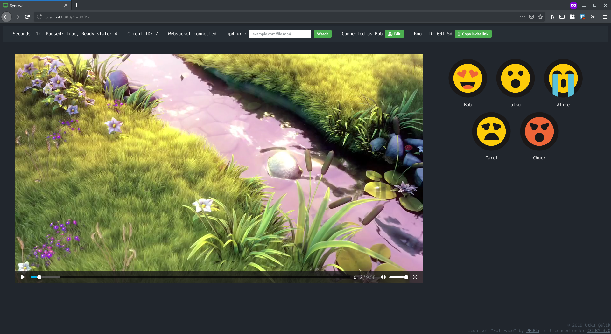

# syncwatch

Syncronizes the position and play/pause state of the `<video>` for all parties viewing the web page to watch a video together. Video sources that are supported are direct mp4 links, magnet URLs (webtorrent[*]) and local files but the file has to be an `.mp4`.

   *: magnet URL must to be seeded on the webtorrent network, regular bittorrent doesn't work in browser.

## Requirements
- A running web server
- python3
- sqlite3

## Setup

- Optionally, set up the ssl certificates first.
    - `sqlite3 syncwatch.db 'CREATE TABLE ssl_certificates (cert_file, key_file)'`
    - `sqlite3 syncwatch.db 'INSERT INTO ssl_certificates (cert_file, key_file) VALUES ("/path/to/cert/fullchain.pem", "/path/to/key/privkey.pem")'`

- Put the `.html`, `.css` and `.js` files into the root folder of a web server.
- Run `python3 websocket_server.py`
    - First install the dependencies
    `pip install --user websockets`
    - If ssl certificates are not set, use `--no-ssl` for the websocket server.
## Demo
You can try it [here](https://utku.website/syncwatch)

## Screenshot

